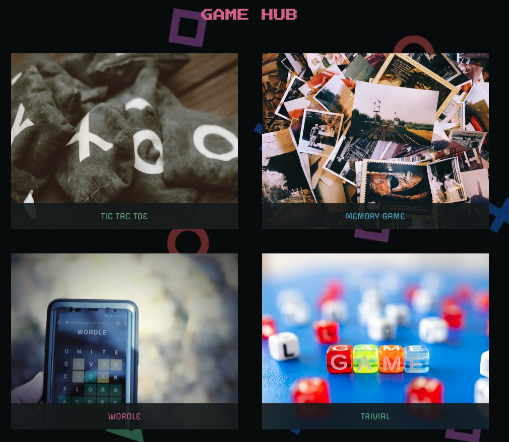
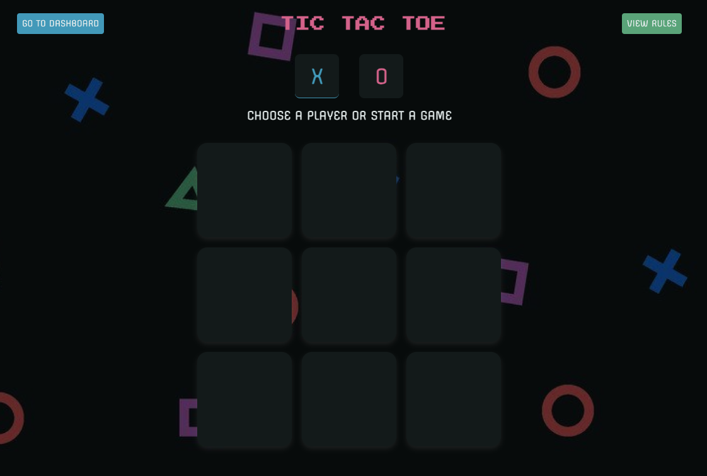
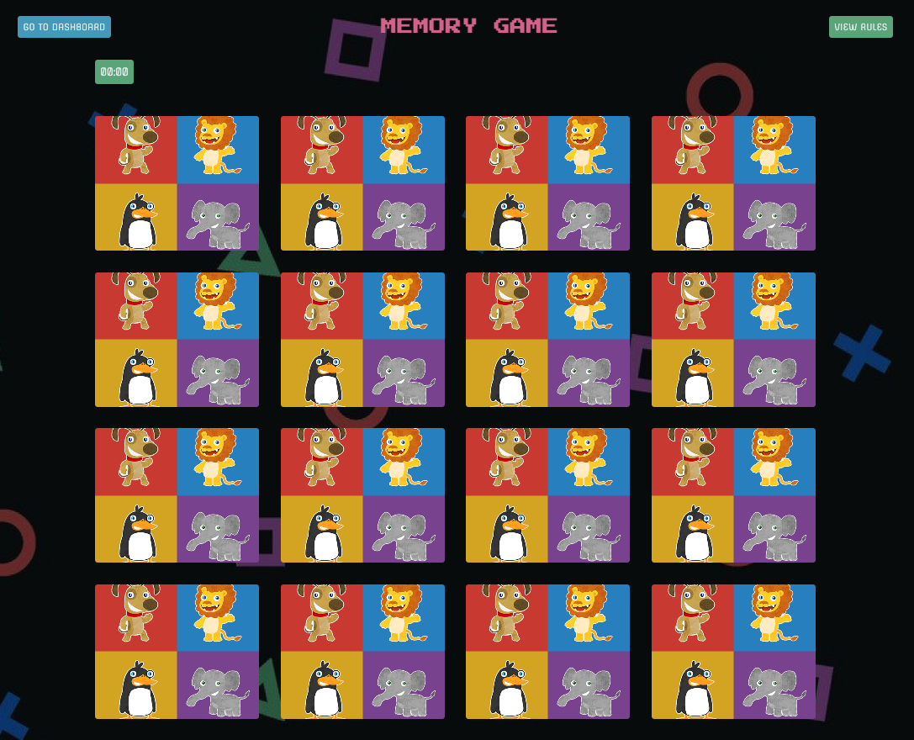
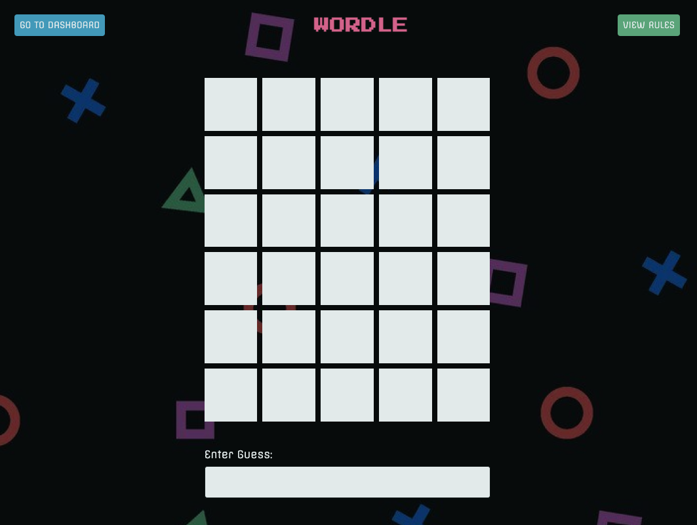
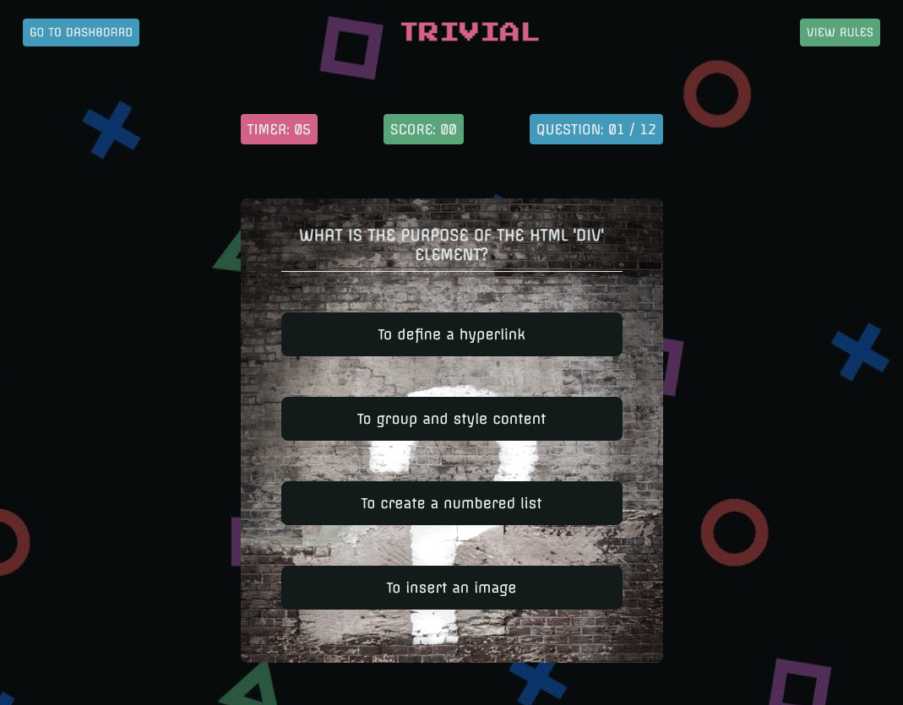
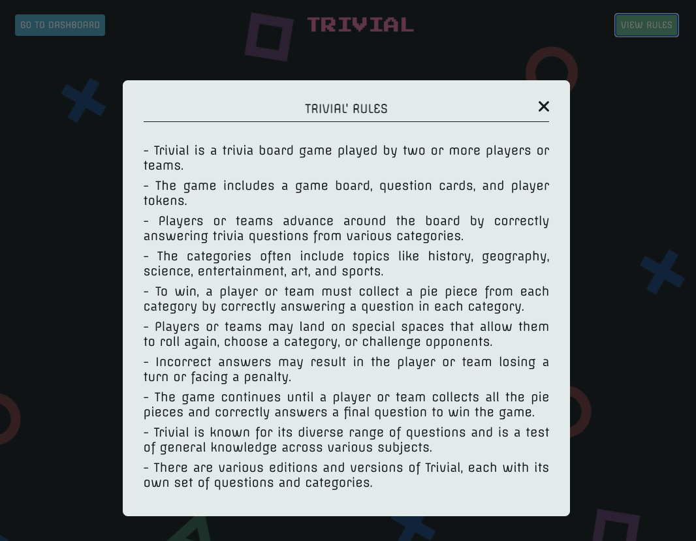

# Project 5 - Game hub VITE and JS

## Acceptance criteria

- [x] Full responsive page
- [x] Project built with Vite
- [x] Components
- [x] All 3 games should be in the same project, so we will have buttons simulating navigation on the page to display the different games
- [x] No bugs - The development of the games must consider all possible cases, and we should not be able to break it when evaluating
- [x] Reusable color variables and styles for CSS
- [x] Proper use of functions in JavaScript

## Implementation:

- The project is a game hub with a dashboard that containes the different games you can play: tic toc toe, trivial, wordle and a memory game
- The project simulate a SPA with routing to go the different games
- It is done with vanilla JS and vite
- It is done using reusable component in JS
- It is fully responsive

## Design:

### Dashboard:

### Tic tac toe game:

### Memory game:

### Wordle:

### Trivial:

### Modal rules:

